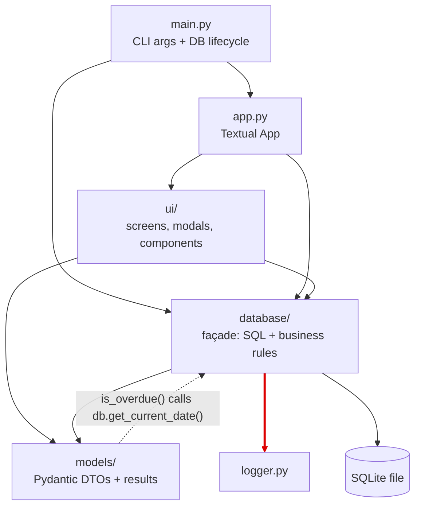

# Architecture Baseline for the Library Management System

**Author:** SUUBI BAKER KANE (Architecture Lead) · **Phase:** 1 — Baseline & Codebase Analysis
**Status:** DRAFT — every dependency claim below was generated by `dependency_check.py` (included in the repo). Re-run it to reproduce any number in this document.

> **Scope note.** This document describes the system *as built*, not as its original README describes it. It does not propose fixes; those belong to another phase which I believe will be phase 2.

---

## 1. Existing Architecture

### 1.1 What the system is

A single-process, terminal-based (Textual TUI) library management application backed by a local SQLite file. Python 3.12, Textual for UI, raw `sqlite3` for persistence, Pydantic for data shapes. About 2,400 lines of application code across four areas:

| Area | Approx. size | Contents |
|------|-------------|----------|
| `database/` | 1,247 lines | Schema, initialization, CSV import, one query module per entity |
| `ui/` | 1,066 lines | Screens, modals, components (Textual) |
| `models/` | small | Pydantic types (`dtypes.py`) and result/response types (`result.py`) |
| `main.py`, `app.py`, `logger.py` | small | Entry point, Textual `App` class, an in-memory message logger |

### 1.2 What kind of architecture is it?

The README calls it a layered architecture (presentation / data model / persistence). The code does not honour that layering strictly. The most accurate description is:

> **A layered structure in name, but functionally a *transaction-script* design over a *façade module*.** Each user operation is one function in `database/query/*.py` that validates, applies business rules, and runs SQL in the same body. The UI calls those functions directly through a single façade namespace (`import database as db`).

There is no separate business-logic layer, no use-case layer, and no composition root.

### 1.3 As-built structure



The dashed arrow (`models → database`) points *against* the intended direction and creates a cycle (see 3.3).

---

## 2. Component Responsibilities

| Component | Stated responsibility | Actual responsibility (verified) |
|-----------|----------------------|----------------------------------|
| `main.py` | Entry point | Parses CLI flags **and** manages the database lifecycle (init, delete, reset time, load test data) by calling `database` directly, then launches the app |
| `app.py` | Textual application shell | Loads CSS, and on mount performs **application/business operations**: sets DB name, checks initialization, reads the current date, runs `db.update_fines()` |
| `ui/screens/` | Presentation | Presentation plus direct database queries (`search_books`, `search_borrowers`, `is_initialized`, `get_current_date`) |
| `ui/modals/` | Presentation | Presentation plus **state-changing operations**: `create_loan`, `checkin`, `checkin_many`, `pay_fines`, `create_borrower`, `init`, `delete`, `set_current_date`, `update_fines` |
| `models/dtypes.py` | Domain-ish data types | Pydantic shapes, but `Loan.is_overdue` reaches into `database` to get "today" |
| `models/result.py` | Result/response types | `OperationResult` and search-result shapes used across the UI/DB boundary |
| `database/__init__.py` | Package init | A **façade**: star-imports every query module, making `db.` the one public API (39 public functions) |
| `database/query/*.py` | Persistence | Persistence **plus business rules** (checkout limits, availability, fine rules — detailed in Members 2 and 3's reports) |
| `database/query/query.py` | SQL helpers | Small execution helpers that open a new connection per call |
| `database/config.py` | Config | Module-level mutable global (`db_name`) |
| `logger.py` | Logging | Singleton in-memory message buffer (`Logger`); used by one database module |

---

## 3. Dependency Relationships

Generated by `dependency_check.py` (package-level, static imports).

### 3.1 Verified package dependencies

| From | To | Files responsible |
|------|----|-------------------|
| `main` | `app`, `database` | `main.py` |
| `app` | `ui`, `database` | `app.py` |
| `ui` | `database` | **9 files** |
| `ui` | `models` | 4 files (`book_detail`, `borrower_detail`, `book_search`, `borrower_search`) |
| `database` | `models` | 5 files (`author`, `book`, `borrower`, `fine`, `loan` query modules) |
| `database` | `logger` | 1 file (`query/borrower.py`) |
| `models` | `database` | **1 file (`models/dtypes.py`)** ← wrong direction |
| `logger` | — | leaf; imports nothing internal |

### 3.2 UI → database coupling (quantified)

**35 direct call sites** from 9 UI files into `db.*`:

| File | Calls |
|------|-------|
| `ui/modals/borrower_detail.py` | 8 |
| `ui/modals/settings.py` | 8 |
| `ui/modals/book_detail.py` | 6 |
| `ui/screens/home.py` | 6 |
| `ui/modals/init_prompt.py` | 2 |
| `ui/modals/time_travel.py` | 2 |
| `ui/modals/create_borrower.py` | 1 |
| `ui/screens/book_search.py` | 1 |
| `ui/screens/borrower_search.py` | 1 |

Of these, the ones that change system state (not just read) include `create_loan`, `checkin`, `checkin_many`, `pay_fines`, `create_borrower`, `update_fines`, `set_current_date`, `init`, `delete`. These are exactly the operations that will become use cases in Phase 2.

(Member 4 owns the full screen → modal → call map; this section only quantifies the coupling.)

### 3.3 Cycle: `database ↔ models`

- `database/query/{author,book,borrower,fine,loan}.py` import `models` (to build return objects).
- `models/dtypes.py` imports `database` (`import database as db`) and uses it inside `Loan.is_overdue`, which calls `db.get_current_date()`.

Consequences:
1. A supposedly inner, passive data type now depends on the persistence layer, so it cannot be used or tested without a database.
2. **The cycle is order-dependent, and verified to fail.** Running `python -c "import database"` from `src/` succeeds, but `python -c "import models"` raises `ImportError: cannot import name 'Author' from partially initialized module 'models' (most likely due to a circular import)`. The app only starts because `main.py`/`app.py` happen to import `database` before `models`. Any reordering of imports (or a test file that imports `models` first) breaks it — a concrete, reproducible reason the cycle matters.
3. "Today's date" is a system-level concern (the app has a simulated "time travel" date stored in the database metadata table). Domain objects are therefore coupled to a testing/demo feature.

---

## 4. Dependency Problems

| # | Problem | Evidence | Why it matters (Clean Architecture) |
|---|---------|----------|-------------------------------------|
| P1 | Inner layer depends on outer layer | `models/dtypes.py` → `database` | Violates the Dependency Rule; entity cannot exist without infrastructure |
| P2 | Package cycle | `database ↔ models` | Blocks independent testing/reuse of either side |
| P3 | Presentation depends directly on persistence | 35 calls, 9 UI files | No boundary to swap, test, or reuse the logic behind a different UI |
| P4 | Business rules live in the persistence layer | `database/query/loan.py`, `fine.py`, … (see Members 2 & 3) | Rules change for different reasons than SQL; they are not independently testable |
| P5 | Application logic in framework shell | `app.py::on_mount` runs `db.update_fines()` | Startup policy is buried in the Textual `App` class |
| P6 | CLI entry point manages database directly | `main.py` uses `db.init/delete/reset_time/...` | Entry point contains lifecycle logic and knows the concrete DB module |
| P7 | Global mutable configuration | `database.config.db_name`, read in `query.py` on every call | Hidden shared state; ordering-sensitive (must call `set_db_name` first) |
| P8 | No composition root | Dependencies are resolved by importing modules, not by construction/injection | Nothing decides which concrete implementation the app uses |

---

## 5. Existing Strengths


1. **A single façade seam.** The UI only reaches persistence via `db.*` — it never runs SQL itself. That means the entire UI↔database boundary is one namespace, so in the next phase, we change can be done by replacing calls behind one seam, not hunting SQL through the UI.
2. **Framework confinement.** Textual is imported only in `app.py` and `ui/`; `sqlite3` only in `database/`. Neither framework leaks into `models/`.
3. **`OperationResult`** (`models/result.py`) already separates *whether an operation succeeded and why* from how the UI renders it, a natural starting point for use-case output.
4. **Separate read-shapes.** Search/list result types are distinct from entity types (e.g. `BookSearchResult` vs `Book`) — an early instinct toward boundary models.
5. **Entity-per-file persistence modules** (`author.py`, `book.py`, `borrower.py`, `loan.py`, `fine.py`) already hint at repository boundaries.
6. **Small, readable codebase** with parameterised SQL (`?` placeholders in the helpers) — low refactor risk and no injection concerns to fix in passing.
7. **Config/CSS/UI structure organised** into screens / modals / components / styles.

---

## 6. Initial Architectural Observations

### 6.1 Where are the boundaries, and how strong are they?

| Boundary | Strength | Note |
|----------|----------|------|
| UI ↔ database | **Weak** | Crossed 35 times, no intermediary |
| Business rules ↔ SQL | **Very weak / absent** | Same functions do both |
| Models ↔ persistence | **Inverted** | Dependency points the wrong way |
| Framework (Textual) ↔ rest | **Reasonable** | Confined to `app.py` and `ui/` |
| Framework (sqlite3) ↔ rest | **Reasonable** | Confined to `database/`, but reached through global config |

### 6.2 Mapping the current code onto Clean Architecture's rings/principles

| Ring (Martin) | What exists today | Gap |
|---------------|-------------------|-----|
| Entities | `models/dtypes.py` (Pydantic, DB-coupled) | No behaviour-owning, framework-free entities |
| Use Cases | *none* — logic lives in `database/query/*` | Missing layer |
| Interface Adapters | `database/query/*` (partly), `OperationResult` | No repository interfaces, no controllers/presenters |
| Frameworks & Drivers | `ui/`, `app.py`, `sqlite3`, `main.py` | Present, but wired directly to each other |

### 6.3 Most tightly coupled pairs

1. `ui/modals/*` ↔ `database` (behavioural coupling)
2. `models/dtypes.py` ↔ `database` (circular)
3. `app.py` / `main.py` ↔ `database` (lifecycle and startup policy)

### 6.4 Most reusable / already separated

`logger.py` (leaf), `ui/components/*`, `ui/custom/*`, `database/schema.py`, `database/names.py`, the small helpers in `database/query/query.py`.

### 6.5 Hand-offs to other members

- **Marion:** confirms which `database/query` functions embed rules (P4) — this report only proves that they do at the function level for `create_loan`/`update_fines`.
- **Patricia:** verifies connection handling (every helper call opens and closes its own `sqlite3` connection) and whether multi-step operations such as `create_loan` run inside a single transaction.
- **Rosemary:** Should ensure that the UI call map reconciles with the 35 call sites in 3.2.

---

## 7. Verification log

Checked against the code:

- [x] **Cycle is real and order-dependent.** `import database` works; `import models` first fails with a circular-import `ImportError` (see 3.3).
- [x] **`Logger` is used in exactly one place.** Only `database/query/borrower.py` imports `logger`; nothing in `ui/` reads it.
- [x] **Façade width.** `dir(database)` exposes **39 public functions** — that is the exact size of the seam the UI depends on.


## Appendix A — How to reproduce the numbers

```bash
python dependency_check.py library-management-system/src
```

Outputs: package edges, cycles, and every `ui → db` call site with file and line number.